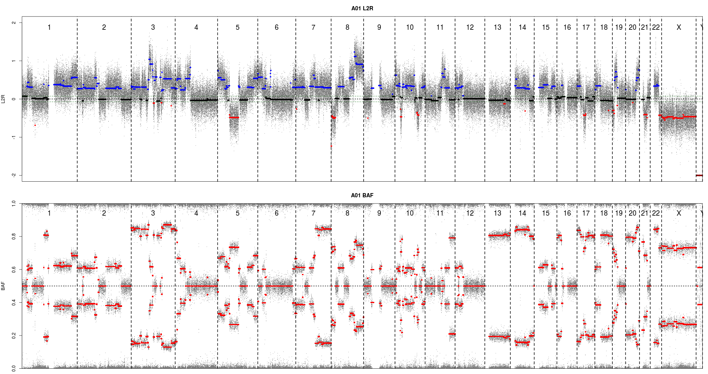
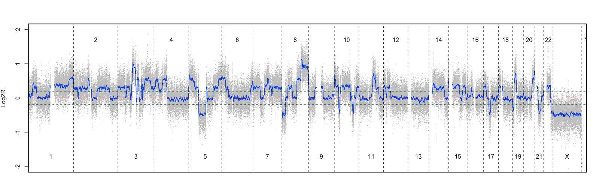

Ce polycopié rassemble différents exercices vous permettant d'apprendre à utiliser le langage de programmation R. Ces exercices sont de difficultés variables. Il est important de réaliser les exercices les plus simples avant de débuter les plus difficiles. 


# Manipulation des objets R (vecteurs, facteurs, listes, tableaux, et matrices)

## Exercice 1 

Soit `a=c("lannister", "targaryen", "baratheon", "starck", "greyjoy")`

1. Quelle est la longueur du vecteur ? *indice : `length`*
2. Essayez de faire `a[1:3]`. Qu'obtenez-vous ?
3. Créez un nouveau vecteur `b` ne contenant que lannister et starck.
4. Essayez de faire a[-1]. Qu'obtenez-vous ?
5. Triez par ordre alphabetique. *indice : `sort`* ?

```{r exercice1, echo = FALSE, eval = FALSE }
a=c("lannister", "targaryen", "baratheon", "starck", "greyjoy")
length(a)
a[1:3]
b = a[c(1,4)]
a[-1]
sort(a)
```

## Exercice 2 

1. Créez un vecteur `a` contenant tous les entiers de 1 à 100. *Indice: `":"`.*
2. Ajoutez les valeurs 200, 201, 202 au vecteur `a`.
3. Créez un vecteur `b` contenant tous les entiers pairs de 2 à 100. *Indice: `seq`.*


*Indice: `seq`.*

```{r exercice2, echo = FALSE, eval = FALSE}
a = c(1:100)
c(a, 200, 201, 202)
b = seq(from = 2, to = 100, by = 2)

```

## Exercice 3 

1. Créer le vecteur  `vec1` contenant tous les multiples de 2 compris entre 1 et 50.
2. Créer le vecteur `vec2` contenant 3 fois chacun des 10 chiffres (soit 0, 0, 0 ; 1, 1, 1 ; 2, 2, 2 ; 3, 3, 3 ; etc.). *Indice: `rep()`*
3. Créer le vecteur `vec3` contenant une fois la lettre A, deux fois la lettre B, trois fois la lettre C ... et 26 fois la lettre Z. Quelle est la longueur de cette suite ? *Indice: `LETTERS`; `length()`*

Pensez à bien regarder l'aide des fonctions. Par exemple, pour la fonction `rep` regardez bien la différence entre les paramètres `each` et `times` ; vous pouvez copier-coller les lignes d'exemple pour bien comprendre chaque paramètre.

```{r exercice3, echo = FALSE, eval = FALSE}
#1
vec1 = seq(from=2, to=50, by=2 )

#2
vec2 = rep(c(0:9), each=3)

#3
vec3 = rep(LETTERS, times = c(1:26))
length(vec3)
```

## Exercice 4

La commande `paste` permet de concataner du texte.  
Essayez `paste("chr", 1, sep="")`.  
Créez, en une seule ligne de commande, le vecteur `vec4` contenant les noms suivants : `chr1 `, `chr2 `, ... , `chr22`, `chrX`, `chrY`.
*Indice : `paste()`*

```{r exercice4, echo = FALSE, eval = FALSE}
paste("chr", 1, sep="")
vec4 = paste("chr", c(1:22,"X","Y"), sep="")

```


## Exercice 5 : Facteurs

1. Définissez un facteur `fac = factor(c("a","b","b","b","a","b","a","a"))`. 
2. Calculez le nombre de `"a"` et de `"b"` dans `fac` en utilisant les fonctions `which` et `length` et des opérateurs binaires (`==`).
3. Que permet de faire la fonction `table` ? Appliquez la à `fac`. __Retenez bien la fonction `table` très très utile !__
 

```{r exercice5, echo = FALSE, eval = FALSE}
fac = factor(c("a","b","b","b","a","b","a","a"))
length(which(fac == "a"))
length(which(fac == "b"))
table(fac)

```

## Exercice 6 : Matrices

1. Exécutez la commande `a = rep(c(0,1), 50)`. Qu'a-t-on fait ?
2. Utilisez `a` pour construire une matrice `A` à 10 lignes et 10 colonnes. *indice : matrix *
3. Affichez les dimensions de cette matrice. *Indices : `dim`, `ncol`, `nrow`*
4. Utilisez la fonction `t` sur cette matrice pour créer une matrice `B`. Que s'est-il passé ?
5. Les commandes `A[1:5, ]` et `B[, 1:5]` permettent de récuperer respectivement les 5 premières lignes de `A` et les 5 premières colonnes de `B`. Inspirez-vous de ces commandes pour récupérez dans `A` les lignes ne contenant que des 1 et dans `B` les colonnes ne contenant que des 0.

```{r exercice6, echo = FALSE, eval = FALSE}
#1
a = rep(c(0,1), 50)

#2
A = matrix(a, ncol = 10, nrow = 10)

#3
dim(A)
ncol(A)
nrow(A)

#4
B = t(A)

#5
line1 = A[seq(2,10,2),]
col0  = B[,seq(1,10,2)]

```

## Exercice 7 : `liste` et tableaux de données (`data.frame`) 

1. Créez une liste `x` contenant :
  - une variable aléatoire gaussienne de taille 10 appelée `a` 
  - un vecteur contenant uniquement des 1 de taille 10 également, appelé `b`. 
On peut accéder aux deux éléments de cette liste avec les commandes `x[[i]]` ou `x$nom_de_la_variable`. *Indices : `list`, `rnorm`.*
2. Créez un objet `y` qui est la transformation de cette liste en `data.frame`. On peut maintenant parcourir les éléments de chaque objet comme pour une matrice avec la commande `y[i,j]` ! *indice = `as.data.frame`*
3. Créez deux objets `z1` et `z2` contenant respectivement les 3 premières et les 3 dernières lignes de `y`. Quelle est la classe de ces deux objets ?
4. Rajoutez à la liste `x` un vecteur `chiffre` contenant les entiers de 1 à 26.
5. Essayez de transformer de nouveau `x` en `data.frame`. Que se passe-t-il ?

````{r exercice7, echo = FALSE, eval = FALSE}
#1
x = list(
  a = rnorm(10),
  b = rep(1, 10)
)
x[["a"]]
x$a

#2
y = as.data.frame(x)

#3
z1 = y[c(1:3) ,]
z2 = y[c(8:10),]
class(z1)
class(z2)

#4
x$chiffre = 1:26

#5
as.data.frame(x)
```

## Exercice final classe objet : Student's Sleep Data


1. Executez la commande `data(sleep)`. Nous venons de charger en mémoire l'un des nombreux jeux de données distribués avec R ! Profitez de l'aide sur ce jeu de données pour en apprendre un peu plus (`?sleep`) ! Tous les jeux de données disponibles avec l'installation de base de R sont accessibles en tapant `data()`.
2. Quel est le type de l'objet `sleep` ?
3. Quelle fonction vous permet d'obtenir rapidement le nombre d'individus par groupe ? Executez la.
4. Combien y-a-t-il de valeurs négatives dans le groupe 1 ? *Indice : `which()`*
5. Soit s un vecteur représentant le sexe des individus : `s = rep(c("f","m","m","f","m","f","m","m","f","m"),2)`. Combinez l'objet `sleep` et le vecteur `s` dans une nouvelle matrice `sleep2`. *Indice : `cbind()`*
6. Quelles sont les noms des colonnes de la matrice `sleep2` ? Renommez la dernière colonne en 'sex'. *Indice : `colnames()`*
7. Combien y-a-t-il de femmes et d'hommes dans chacun des groupes ?

```{r exerciceFinalClasseObjet, echo = FALSE, eval = FALSE}
#1 
data(sleep)
#2
typeof(sleep); class(sleep)
#3
table(sleep$group)
#4
length(which(sleep$extra < 0))
#5
s = rep(c("f","m","m","f","m","f","m","m","f","m"),2)
sleep2 = cbind(sleep, s)
#6
colnames(sleep2)
colnames(sleep2)[4] = "sex"
#7
table(sleep2$s, sleep2$group)

```

# Lire et sauvegarder des données

## Exercice 8 : Lire les données d'un fichier : fonction `read.table`

Il est possible de lire les données stockées dans des fichiers sous format `txt` grâce, entre autres, aux fonctions
suivantes: `read.table()`, `read.csv()`, `read.csv2()` et `scan()`. Par ailleurs, la fonction `read.xls()` (resp. `write.xls()`) du package `gdata` fournit les outils pour lire (resp. écrire) des fichiers au format Excel. Il existe aussi la fonction `read.xlsx` (resp. `write.xlsx`) du package `xlsx`.

(Récupérez les fichiers demandés sur le site xxxxxxx). Vous pouvez ouvrir au préalable ces différents fichiers dans un éditeur de texte afin d'identifier le séparateur de colonnes, le symbole de décimale, comment sont définies les valeurs manquantes etc ...

1. Importez dans une variable nommée `A` le jeu de données nommé `auto2004_original.txt`. **Indice : le séparateur de colonne 'tabulation' correspond à '\t' en informatique*
2. Importez dans une variable nommée `B` le jeu de données `auto2004_sans_nom.txt`.
3. Importez dans une variable nommée `C` le jeu de données `auto2004_virgule.txt`.
4. Importez dans une variable nommée `D` le jeu de données `auto2004_don_manquante.txt`. Combien de valeurs manquantes sont contenues dans le fichier ?
5. Importez dans une variable nommée `E` le jeu de données `auto2004_don_manquante(99999).txt`.
6. Quel est le mode des objets créés par la fonction `read.table()` ?

*Indice : `help("read.table")`, `help("is.na")`*


```{r exercice8, echo = FALSE, eval = FALSE}
#1
A = read.table(file="auto2004_original.txt", sep="\t", header = TRUE)

#2
B = read.table(file="auto2004_sans_nom.txt", sep="\t", header = FALSE)

#3
C = read.table(file="auto2004_virgule.txt", sep="\t", header = TRUE, dec = ",")

#4
D = read.table(file="auto2004_don_manquante.txt", header = TRUE, sep="\t", na.strings = "")
nb = length(which(is.na(D) == TRUE))

#5
E = read.table(file="auto2004_don_manquante(99999).txt", header = TRUE, sep="\t", na.strings = "99999")

#6
class(E)
```

## Exercice 9 : Enregistrer des données

Créer la matrice suivante :
\[
  A = \left[
    \begin{array}{cccc}
      1 & 2 & 3 & 4\\
      5 & 6 & 7 & 8\\
      9 & 10 & 11 & 12\\
    \end{array} 
  \right]
\]

1. Ecrire la matrice `A` dans un fichier nommé `matrice.txt`. Que remarquez-vous?
2. Ajouter des arguments à la commande précédente pour retirer des noms aux lignes et aux colonnes du fichier créé.
3. Sauver la matrice `A` au format `.Rdata` dans le fichier `matriceA.Rdata` grâce à la fonction `save`.
4. Que donne la commande `C = load("matriceA.Rdata")` ?
5. Sauver toutes les variables dans un fichier nommé "données.Rdata"
  
```{r exercice9, echo = FALSE, eval =FALSE}

A = matrix(seq(12), ncol = 4, byrow = TRUE)

#1
write.table(A, file = "matrice.txt")

#2
write.table(A, file = "matrice.txt", row.names = FALSE, col.names = FALSE)

#3
save(A, file="matriceA.Rdata")

#4
C = load("matriceA.Rdata")
### la matrice A est rechargée.
### la variable C vaut "A"

#5
save(list = ls(), "données.Rdata")
```


# Fonctions graphiques

## Exercice 10 : quelques graphiques des base en R 

1. Chargez le jeu de données `iris`déjà présent dans R.
2. Pour chaque espèce de fleurs, indiquez le nombre de lignes.
3. A partir du résultat précédent, réalisez une représentation en camembert (pie chart), puis en bâtons (barplot). *Indice `pie()`*
4. Tapez la ligne de commande suivante : `summary(iris)`.

Quel résultat obtenez-vous ?

5. Une représentation adéquate est la boîte à moustache (boxplot). Créez un boxplot pour les 4 variables numériques du jeu de données `iris`. *Indice `boxplot()`*
6. Réalisez le même graphique en ajoutant un titre et en supprimant les valeurs extrêmes.
7. Représentez le pie chart et le boxplot sur la même fenêtre graphique. *Indice `par()`, option mfrow*.
8. Exportez le graphique précédent en pdf sur votre machine. *Indice `pdf()` ; `dev.off()`*
9. Représenter un scatter plot simple avec en abscisse la longueur des pétales et en ordonnées leur largeur. *Indice `plot`*
10. Afin de découvrir les différents paramètres de la fonction `plot`, refaite le même graphique qu'à la fonction précédente en :  
  
    * augmentant la taille des points _Indice : `cex`_
    * remplaçant les points par des triangles de couleur rouge _Indice `pch` option_
    * ajoutant une ligne horizontale en pointillé à y=1 _Indice : `abline`_
    


```{r exercice10, echo = FALSE, eval=FALSE}
#1
data(iris)

#2
p = table(iris$Species)

#3
pie(p)
barplot(p)

#4
summary(iris)

#5
boxplot(iris[,1:4])

#6
boxplot(iris[,1:4], title="Iris Boxplot", outline=FALSE)

#7
par(mfrow=c(1,2))
boxplot(iris[,1:4], title="Iris Boxplot", outline=FALSE)
pie(p)

#8
pdf("plotIris.pdf")
par(mfrow=c(1,2))
boxplot(iris[,1:4], title="Iris Boxplot", outline=FALSE)
pie(p)
dev.off()

#9
plot(iris$Petal.Length, iris$Petal.Width)

#10
plot(iris$Petal.Length, iris$Petal.Width, cex=5)
plot(iris$Petal.Length, iris$Petal.Width, pch=17, col="red")
abline(h=1, lty=2)

#9
pairs(iris[,1:4], col=as.numeric(iris$Species), pch=16)

#10
pdf("pairs_iris.pdf")
pairs(iris[,1:4], col=as.numeric(iris$Species), pch=16)
dev.off()
```


## Exercice 11 : distribution et density plot

1. Charger le jeu de données `airquality`.
2. Prendre connaissance des données (dimension, type).
3. Construire un histogramme de la variable `Ozone`. Représenter l'histogramme en terme de probabilité de densité plutôt qu'en terme de fréquence (axe Y). Ajouter un titre, modifier le noms des axes, et colorer les barres de l'histogramme en gris  et les traits de l'histogramme en bleu. Augmenter la taille  du pas de l'histogramme à 30.
4. Regarder l'aide de la fonction `density()`. Appliquer cette fonction à la variable `Ozone`. Cela retourne-t-il une erreur ? Pourquoi ? Corriger la en spécifiant une option.
5. Ajouter la courbe de densité précédemment générer à l'histogramme. *Indice `lines()`*

```{r exercice11,echo = FALSE, eval=FALSE}
data(airquality)
hist(airquality$Ozone)
hist(airquality$Ozone, freq=FALSE, main="Histogramme Ozone", xlab="Ozone", ylab="Densité", col = "gray", border = "blue")

hist(airquality$Ozone, freq=FALSE, main="Histogramme Ozone", xlab="Ozone", ylab="Densité", col = "gray", border = "blue",
      breaks=30)

d = density(airquality$Ozone, na.rm=TRUE)
lines(d)

```


# Manipulation des boucles et réalisations de tests

## Exercice 12 : `for`

1. Lisez l'aide sur la procédure permettant de réaliser des boucles indicées `for` (`help("for")`). 
*Remarque :* demander de l'aide sur cette procédure avec la syntaxe `?for` ne fonctionnera pas ! Pourquoi ?
2. Créer une boucle qui affiche l'indice `i ` de l'itération en cours (10 itérations)
3. A l'aide d'une boucle, calculez la somme des entiers pairs compris entre 1 et 100.

```{r exercice&2, echo = FALSE, eval = FALSE }
#1
help("for")

#2
for (i in 1:10) print(i)

#3
somme = 0
for (i in seq(2,100,2)) {
  somme = somme + i
}
somme
```


## Exercice 13 : `for`, `if` et `else`

1. Comme dans l'exercice précédent, lisez l'aide de la procédure conditionnelle `if` : (`help("if")`).
2. Utilisez les structures `if` et `else` pour créer un programme qui prend en entrée un réel $x$ et qui lui associe $y=x^2$ si $x$ est strictement positif et $y=x^3$ si $x$ est négatif ou nul. Testez pour les valeurs $x$ = 25, -2, 12 et 0.
3. Utilisez les structures `if` et `else` pour créer un programme qui imprime à l'écran, pour chaque entier relatif $i$ compris entre -10 et 10, $i^3$ si $i<=0$, ou $i^2$ si $i>0$. 

```{r exercice13, echo = FALSE, eval = FALSE }
#1
help("if")

#2
x = 25  
y = 0
if (x > 0){
  y = x^2
}
else{
  y = x^3
}

#3
for (i in -10:10){
  x = i
  y = 0
  if (x > 0){
    y = x^2
  }
  else{
    y = x^3
  }
  print(paste(i, y, sep=" => "))
}
```


## Exercice 15 : un moyen plus rapide de faire des boucles en R !

1. Créer une matrice `matrice ` contenant des valeurs tirées aléatoirement de dimension 10 lignes x 10 colonnes et dont les éléments suivent une loi normale de moyenne nulle et de variance 2.32.
2. Afficher nombre d'éléments positifs et négatifs de la matrice. Remplacer les nombre négatifs par 0.
3. Afficher les `marges ` de matrice (sommes des valeurs en lignes et en colonnes).
*Indice : `apply`, `sum`*
4. Afficher la moyenne des lignes et des colonnes de la matrice. 
5. Un autre moyen d'afficher rapidemment la somme/moyenne des lignes/colonnes d'une matrice, est d'utiliser des fonctions R pré-existantes : `rowSums`, `colSums`, `rowMeans`, `colMeans`.

```{r exercice15, echo = FALSE, eval=FALSE}
#1
matrice = matrix(rnorm(n=100, mean = 0, sd = 2.32),nrow = 10, ncol=10)

#2
nbPos = length(which(matrice > 0))
idxNeg = which(matrice < 0)
nbNeg = length(idxNeg)
matrice[idxNeg] = 0

#3
apply(matrice, 1, sum)
apply(matrice, 2, sum)

#4
apply(matrice, 1, mean)
apply(matrice, 1, mean)

#5
rowSums(matrice); colSums(matrice)
rowMeans(matrice); colMeans(matrice)
```

# Créer et utiliser ses propres fonctions R


## Exercice 16 : notre première fonction

1. Exécutez les commandes `data(iris)` puis `str(iris)`. Nous venons de charger en mémoire l'un des nombreux jeux de données distribués avec R ! Profitez de l'aide sur ce jeu de données pour en apprendre un peu plus sur les fleurs (`?iris`) ! Tous les jeux de données disponibles avec l'installation de base de R sont accessibles en tapant `data()`.

2. Créez la fonction `moyenneET` suivante et décryptez la :
```{r, echo = FALSE}
moyenneET = function(i) c(moy = mean(iris[,i]), et = sd(iris[,i]) )
```

3. Afficher l'aide de la fonction `apply`. En utilisant cette fonction, calculez la moyenne et l'écart type des colonnes numériques du dataset `iris`. Comparer le résultat avec celui obtenu par la foncion `moyenneET`.

*Remarque :* pour exécuter plusieurs commandes au sein d'une même fonction, il faut utiliser des accolades `{...}`.

```{r exercice16, echo = FALSE, eval = FALSE}
#1
data(iris)
str(iris)
moyenneET(2)

#2
moyenneET <- function(i) {
  moy = mean(iris[,i])
  et  = sd(iris[,i])
  return( c(moy = moy, et = et) )
}


#3
?apply
moy = apply(iris[,c(1,2,3,4)], 2, mean)
et  = apply(iris[,c(1,2,3,4)], 2, sd)
moyenneET(1)
moyenneET(2)
moyenneET(3)
moyenneET(4)
```

## Exercice 17 : une autre fonction toute simple

Créer une fonction nommée `somme ` qui calcule la somme de deux variables `x ` et `y ` passées en arguments.

```{r exercice17, echo = FALSE, eval=FALSE}
somme = function(x, y){
  resultat = x+y
  return(resultat)
}
```

## Exercice 18 : Nombre mystère

1. Choisir un nombre mystère entre 1 et 100, et le stocker dans un objet que l'on nommera `nombre_mystere`. Ensuite, créer une boucle qui à chaque itération effectue un tirage aléatoire d'un entier compris entre 1 et 100. Tant que le nombre tiré est différent du nombre mystère, la boucle doit continuer. A la sortie de la boucle, une variable que l'on appellera `nb_tirages` contiendra le nombre de tirages réalisés pour obtenir le nombre mystère.
2. Utiliser le code de la question précédente pour réaliser la fonction `trouver_nombre`, qui, lorsqu'on lui donne un nombre compris entre 1 et 100, retourne le nombre de tirages aléatoires d'entiers compris entre 1 et 100 nécessaires avant de tirer le nombre mystère.
3. En utilisant une boucle for, faire appel 1000 fois à la fonction `trouver_nombre()` qui vient d'être créée. A chaque itération, stocker le résultat dans un élément d'un vecteur que l'on appellera `nb_essais_rep`. Enfin, afficher la moyenne du nombre de tirages nécessaires pour retrouver le nombre magique.

*Indice : `sample`, `while`*

```{r exercice18, echo = FALSE, eval = FALSE}
# 1
nombre_mystere = 59

s = 0
nb_tirages = 0
while (s != nombre_mystere){
  s = sample(1:100, 1)
  nb_tirages  = nb_tirages + 1
}
nb_tirages

# 2
trouver_nombre = function(nombre_mystere){
  if (nombre_mystere >=1  & nombre_mystere <=100){
    s = 0
    nb_tirages = 0
    while (s != nombre_mystere){
      s = sample(1:100, 1)
      nb_tirages  = nb_tirages + 1
    }
    nb_tirages
  }
  else{
    warning("Votre nombre doit être compris entre 1 et 100")
  }
}

#3
nb_essais_rep = c()
for (i in seq(1000)){
  tmp = trouver_nombre(39)
  nb_essais_rep = c(nb_essais_rep, tmp)
}

mean(tmp)
```

# Exercice 19 : Création d'une fonction, traitement de chaines de caractères

Supposons que les adresses e-mails des étudiants de centralsupelec soient constituées de la manière suivante: le prénom et le nom de famille séparés par un point, le symbole arobase et enfin le nom de domaine. Supposons de plus que les étudiants ont un seul prénom, et aucune particule au nom de famille. La syntaxe des adresses e-mail est donc comme suit :

nom.prenom@etudiant.centralsupelec.fr.

1. Créer une fonction `parseMail`, qui à partir d'une adresse e-mail d'un étudiant, retourne un data.frame contenant trois variables : le prénom, le nom et l'adresse e-mail de cet étudiant.
2. Utiliser cete fonction pour créer un data.frame `emails.df` à partir du vecteur `emails`, contenant tous les prénoms, noms et adresses e-mail des étudiants

*indice : `strsplit`*

```{r exercice19mail, echo = FALSE, eval = FALSE}
  emails = c( "john.snow@etudiant.centralsupelec.fr",
              "patti.smith@etudiant.centralsupelec.fr",
              "rick.grimes@etudiant.centralsupelec.fr",
              "mere.theresa@etudiant.centralsupelec.fr")
```


```{r exercice19, echo = FALSE, eval=FALSE}
#1
parseMail = function(email){
  nom_prenom = unlist(strsplit(email, "@"))[1]
  nom_prenom = unlist(strsplit(nom_prenom, "\\."))
  prenom = nom_prenom[1]
  nom = nom_prenom[2]
  data.frame(prenom = prenom, nom = nom, email = email)
}

#2
emails.df = c()
for (m in emails){
  df = parseMail(m)
  emails.df = rbind(emails.df,df)
}
```


# Exercice 20 : Fonctions appliquées aux éléments d'une liste

Soit une liste nommée twittos, disponible à l'adresse suivante :
https://pf-bb.github.io/CentraleSupelec-R-genomics/

Elle contient des informations fictives sur des utilisateurs de Twitter ; chaque élément de cette liste est une liste dont les éléments sont les suivants :

* screen_name: nom d'utilisateur
* nb_tweets: nombre de tweets
* nb_followers: nombre de followers
* nb_friends: nombre de followings
* created_at: date de création du compte
* location: ville renseignée

1. Importer le contenu du fichier dans la session R

2. Utiliser la fonction `lapply()` sur twittos pour récupérer une liste contenant uniquement les noms d'utilisateurs. Faire de même pour le nombre de followers, puis appliquer `unlist()` au résultat.

3. Créer une fonction qui, quand on lui fournit un élément de la liste twittos , c'est-à-dire les informations sous forme de liste d'un seul utilisateur, retourne ces informations sous forme de tableau de données. Nommer cette fonction `twittos_to_df`.

4. Appliquer la fonction `twittos_to_df()` au premier élément de la liste twittos, puis utiliser la fonction `lapply()` pour appliquer la fonction `twittos_to_df()` à tous les éléments de la liste. Stocker ce dernier résultat dans un objet appelé `res`

5. Quelle est la structure de l'objet `res` obtenu à la question précédente ?

```{r exercice20, echo = FALSE, eval = FALSE}
#1
load("twittos.rda")

#2
lapply(twittos, function(twit){twit$screen_name})

#3
twittos_to_df = function(twit){
  return(data.frame(twit))
}

#4
twittos_to_df(twittos[1])
res = lapply(twittos, twittos_to_df)
```

# Exercices de Niveau Avancé

## Exercice 21 : Layout

Les données `old faithful geyser ` ont été collectées dans le cadre d'une étude du temps d'attente entre deux éruptions et la durée des éruptions au sein du parc National de Yellowstone (USA). Ce jeu de données est disponible sous R et est nommé `faithful` (package datasets). Le seuil critique d'attente au delà duquel la probabilité que la prochaine éruption soit longue et forte est fixé à 63.

1. Télécharger et visualiser le jeu de données (fonction `plot( )`), en affichant également la limite des 63 secondes.
2. Calculer un vecteur `vec` de 100000 points correspondant à la loi normale de moyenne `m` et d'écart type `sd` correspondant à la moyenne, et à l'écart type, des durées d'éruption.
3. Construire un histogramme de la durée d'éruption. Représenter l'histogramme en terme de densité plutôt qu'en terme d'effectifs (axe Y). Ajouter un titre, nommer les axes et colorer les barres de l'histogramme en vert et les traits de l'histogramme en rouge. Augmenter la taille du pas de l'histogramme à 20.
4. Ajouter la densité du vecteur de point `vec` à l'histogramme (*Indice : `lines()`, `density()`*. Que remarquez-vous
?
5. Afin de mieux apprehender la distribution des données, il est possible d'afficher plusieurs graphiques sur une même grille. L'objectif de cette partie est d'afficher le scatterplot de la question 1, et au dessus et sur la droite, les histogrammes des variables "eruption" et "waiting", respectivement. Pour cela, nous utiliserons la fonction `layout()`.

5.1 Créer la matrice suivante :

```{r, echo = FALSE, eval = TRUE}
layMat = matrix(c(2,0,1,3), ncol=2, byrow=TRUE)
layMat
```

Cette matrice permettra à la fonction `layout` d'afficher les prochains plot :

* en bas à gauche
* en haut à gauche
* en bas à droite

(n.b : le chiffre `0` indique qu'aucun `plot` ne pourra être affiché dans cette zone)

5.2 Utiliser la fonction `layout` et la matrice `layMat` pour créer une grille d'affichage ayant les proportions suivantes, puis afficher le résultats (*indice : `layout.show()`*) : 

* première colonne : 70% de la largeur totale
* deuxième colonne : 30% de la largeur totale
* première ligne : 30% de la largeur totale
* deuxième ligne : 70% de la largeur totale

5.3 Afficher sur ce `layout` les 3 graphiques suivants : 

- le scatter plot de la question 1
- l'histogramme de la variable "eruption"
- l'histogramme de la variable "waiting" (*indice : pensez à mettre l'hitogramme à l'horizontal*)

```{r exercice21, echo = FALSE, eval=FALSE}
#1 
data(faithful)
?faithful
plot(faithful$waiting, faithful$eruptions)
abline(v=63, col="red")

#2
vec = rnorm(100000, mean = mean(faithful$eruptions), sd = sd(faithful$eruptions))

#3 
hist(faithful$eruptions, freq = FALSE, main = "Histogramme de la durée des eruptions", xlab = "Durée de l'eruption", ylab = "Densité", col="green", border = "red", breaks = 20)

#4 
lines(density(vec))

#5
#5.1
layMat = matrix(c(2,0,1,3), ncol=2, byrow=TRUE)

#5.2
layout(layMat, widths=c(0.7, 0.3), heights=c(0.3, 0.7 ))
layout.show(n=3)

 ## scatter plot
plot(faithful, xlim=range(faithful$eruptions), ylim=range(faithful$waiting))
xhist = hist(faithful$eruptions, plot=FALSE, breaks=20)
yhist = hist(faithful$waiting  , plot=FALSE, breaks=20)
barplot(xhist$density, axes=FALSE, space=0) 
barplot(yhist$density, axes=FALSE, space=0, horiz=TRUE)

```

## Exercice 22 : ah si j'étais riche !
Un ami vous propose le jeu suivant. On lance un dé. Si le résultat est 5 ou 6, on gagne 3€, si le résultat est 4 on gagne 1€ et si c'est 3 ou moins on perd 2.5€. Avant d'accepter la partie, vous essayez de simuler ce jeu, pour voir si vous avez des chances de vous enrichir. 

1. Créer une fonction `simul` qui prend comme argument un entier compris entre 1 et 6, et qui retourne la somme correspondante.
2. Créer un vecteur `tirage`, simulant le résultat de 1000 tirages de dés.
3. Afficher sur un graphique la simulation du jeu.

Conclusion ?

```{r exercice22, echo = FALSE, eval=FALSE}

#1
simul = function(i){
  res = NULL
  if (i <= 6 && i >= 1){
    res = switch(i, -2.5, -2.5, -2.5, 1, 3, 3)
  } 
  else {
    warning("Un tirage de dès en peut donner qu'un chiffre entre 1 et 6")
  }
  return(res)
}

#2
tirage = sample(x = c(1:6),size = 1000, replace = TRUE )

#3
resultat = sapply(tirage, simul)
gain = cumsum(resultat)
plot(gain)

```


## Exercice 23 : James Bond autour du monde 

R contient de nombreux packages nous permettant de faire des représentations graphiques de toutes sortes. Certains packages permettent de faire des représentations spatiales (`rgdal`, `sp`, `rgeos`,`cartography`). Connu comme une boite à outil dédiée à la cartographie thématique, le package `cartography` est développé au sein de l'UMS RIATE (CNRS, CGET, Université Paris Diderot) par Nicolas Lambert et Timothée Giraud.

Commencez par installer le package `cartograpgy` disponible sur le CRAN (via l'utilitaire  RStudio ou en ligne de commande).

Nous allons construire une carte dont l'objectif sera de montrer le nombre de fois où 007 s'est rendu dans chaque pays.

Pour cela, télécharger les données disponibles à l'adresse suivante : http://wukan.ums-riate.fr/bond/bondfiles.RData.

Nous avons chargé 2 objets : 

* Le data frame `BondVisits` contient 2 colonnes, l'identifiant des pays (ISO2) et le nombre de visites (n).
* La liste `WorldCountries` : cette liste est une `SpatialPolygonsDataFrame` (spdf) contenant la carte de tous les pays du monde.

1. Afficher la carte du monde grâce à la fonction `plot`, qui prend en argument des données au format spdf, avec l'arrière plan en gris. On voit que les marges de la figures sont trop grandes. Modifiez les pour maximiser l'espace pris par la map monde. Redessinez la map monde. *Indice `par()` option `mar`*
2. Ajouter les cercles proportionnels correspondant aux nombres de visites dans chaque pays de 007, avec la couleur de votre choix et des bords blanc. Modifier le titre de la légende de "n" à "Nombres de visites".
3. On veut à présent représenter le nombres de visites par des couches de couleurs différentes plutôt que par des symboles proportionnels. Quelle fonction doit-on utiliser ? Appliquer la fonction aux données. Le résultat obtenu vous parait-il correct ? 
4. Regarder le contenu de l'objet `WorldCountries@data`. Construisez un nouveau dataframe contenant tous les pays et les nombres de visites (NA ou 0 si inconnu). Réessayez de créer le graphique de la question précédente. *Indice : pour créer le nouveau dataframe, la fonction `merge` peut vous être utile*

```{r exercice23, echo = FALSE, eval=FALSE}
library(cartography)
load((url("http://wukan.ums-riate.fr/bond/bondfiles.RData")))
head(BondVisits)

plot(WorldCountries, bg="gray")
par(mar = c(0,0,1.2,0))
plot(WorldCountries, bg="gray")
propSymbolsLayer(spdf = WorldCountries, df = BondVisits, var="n", border="white", col="magenta3", legend.title.txt = "Nombres de visites")

choroLayer(spdf = WorldCountries, df = BondVisits, var="n")

BondVisits2 = merge(BondVisits, WorldCountries@data, by="ISO2", all.y=TRUE)

choroLayer(spdf = WorldCountries, df = BondVisits2, var="n", legend.title.txt = "Nombre de visites")
```

## Exercice 24 : Profil CGH

Les technologies de génomique permettent de détecter des abérrations au niveau de notre génome (CNA - Copy Number Alteration) : duplication, remaniement, translocation, perte, etc ... En cancérologie, le génome des tumeurs est souvent anormal (voir la figure "Profil CGH").

Cet exercice a pour objectif de reconstruire ce profil à partir du package "chromosomes" (développé par B. Job, Gustave Roussy) et du jeu de données A01.ASPCF, issu de l'analyse par des microarrays du type "Oncoscan" (Affymetrix) de la tumeur d'un patient.



1. Installer le package 'chromosomes_1.0-0.tgz' (ce fichier est récupérable sur le site du TP). Charger le package avec la commande `library()`; Enfin, charger le dataset `hg19`. Ceci importe dans votre session R une variable nommée `cs` (chromosome structure) décrivant les positions du génome humaine (version hg19).
    a. Quelle est la classe de la variable `cs` ?
    b. Combien le génome contient-il de chromosomes ? (*Indice : parcourir l'obet `cs` avec la fonction `str`*)
    c. Quelle est la taille du génome humain (dans sa version hg19) ?

2. Charger le fichier `A01.ascat.ASPCF.RDS` dans la variable `cgh`
    a. Quelle est la classe de la variable `cgh` ?
    b. Combien d'éléments contient cette variable ?
    c. Quelle est le genre du patient à qui correspond le profil ?

3. Construction du profil CNA
    a. Construction des vecteurs de points à afficher depuis la variable `cgh` :

        - Créer le vecteur `tumor_lr` à partir de la variable `cgh`
        - Créer le vecteur `x_snp` contenant les positions génomique des points de mesure
        - Créer le vecteur `x_chr` contenant les nom des chromosomes auxquels appartiennent les points de mesure
        - Créer le vecteur `all_chr` contenant une seule occurrence de ces noms de chromosomes

    b. En utilisant la variable `cs`, construisez le vecteur `chr_length`, contenant les longueurs des chromosomes. Utiliser la fonction `names` et la variable `cs` pour nommer tous les éléments du vecteur `chr_length`.

    c. Convertir les positions relatives au chromosome du vecteur `x_snp` en position absolue sur le génome (vecteur `x_snp_abs`)

    d. Afin d'afficher une version lissée du signal mesuré, calculer la "running médiane" (*Indice : fonction `runmed`*) à partir du vecteur `l2r_tumor`

    e. A partir de ces vecteurs, essayez de reproduire l'image suivante.



*Indice : les lignes vertes correspondent à la moyenne des valeurs absolues des différences mesurées entre deux sondes*

```{r exercice24, echo = FALSE, eval = FALSE}
#1
install.packages("chromosomes_1.0-0.tar.gz", repos = NULL, type = "source")
library("chromosomes")
data(hg19)
#1.1
class(cs)
#1.2
str(cs)
length(cs$chromosomes$chrom)
#1.3
str(cs)
cs$genome.length

#2
cgh = readRDS(file = "data/A01.ascat.ASPCF.RDS")

#2.1
class(cgh)
#2.2

length(cgh)
#2.3
cgh$gender

#3.1
y_tumor_l2r = cgh$Tumor_LogR[,1]
x_snp       = as.numeric(as.vector(cgh$SNPpos$pos))
x_chr       = as.vector(cgh$SNPpos$chrs)
all_chr     = unique(x_chr)


#3.2
chr_length = cs$chromosomes$chr.length.toadd
chr_names  = cs$chromosomes$chrN
names(chr_length) = chr_names

#3.3
x_snp_abs = x_snp
for (i in all_chr){
  idx = which(x_chr == i)
  
  if (i == "X")      { tmp.chr = 23}
  else if (i == "Y") { tmp.chr = 24}
  else               { tmp.chr = as.numeric(i)}
  
  valtoadd = chr_length[tmp.chr]
  
  x_snp_abs[idx] = x_snp_abs[idx] + valtoadd
}

#3.4
l2r_runmed = runmed(y_tumor_l2r ,  k = 301)

#3.5
plot(x_snp_abs, y_tumor_l2r, ylim = c(-2, 2),col = "gray", pch = ".", ylab = "Log2R", xlab = "", axes = F, xaxs = "i")
axis(2)
points(x_snp_abs, l2r_runmed, col="blue", pch = ".")
abline(h = 0, lty = 2, col = "red")
abline(v = c(0,cs$chromosomes$chr.length.sum), lty = 2, col = "black")
box(lwd = 2)
tmp = mean(abs(diff(y_tumor_l2r))) 
abline(h = c(-tmp, tmp), lty = 2, col = "darkgreen")

pair = seq(from = 2, to = 24, by = 2)
impair = seq(from = 1, to = 23, by = 2)

text(x = cs$chromosomes$mid.chr[pair]   + cs$chromosomes$chr.length.toadd[pair],   y = 1.7 , labels = all_chr[pair])
text(x = cs$chromosomes$mid.chr[impair] + cs$chromosomes$chr.length.toadd[impair], y = -1.7, labels = all_chr[impair])
```


